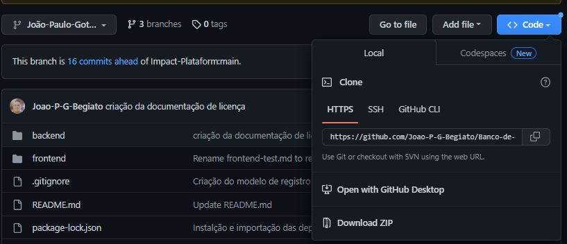
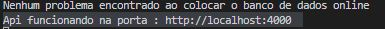

# API de produtos 

## Projeto desenvolvido para o processo seletivo do Banco-de-Talentos Jedi da Impact Plataform.

[Sobre](#sobre-) - [Softwares & Ferramentas](#softwares--ferramentas-utilizadas-neste-projeto-) - [Deploy](#deploy-) - [Consumo da API](#consumo-da-API-) - [Licença](#licenca-) - [Contato](#contato-)

## Sobre 🔎    

***Conceito*** 💡  

Neste projeto foi requisitado a construção de uma API Rest de produtos que precisaria ter os seguintes métodos em suas rotas:
- Rotas de Produto   
rota: /Products [get/post]   
rota: /Products/$ID  [get/put/delete]      

- Rotas de Cotação     
rota: /Currency/ [get]   
rota: /Currency/$symbol [get]

---

## Softwares & Ferramentas utilizadas neste projeto 📚

- JavaScript
- Node.js
- API Rest
- Express
- SQLite 3
- Dot env
- Nodemon
- Jest
- Supertest
- Swagger
- Git
- GitHub

---

### ***Banco de Dados*** 💾
Importante lembrar que, as informações alimentadas não ficarão salvas para sempre, pois o banco de dados utilizado (SQLite) acaba sofrendo um reset para o estado incial dele, aquele que estava quando foi feito o deploy. 

---


## Deploy 🚀

### ***Utilização para Desenvolvimento*** ⚙️

Primeiramente será necessário clonar esse repositório, você acessar pelo terminal a pasta aonde quer clonar o repositório e rodar o seguinte comando:

```
git clone https://github.com/Joao-P-G-Begiato/Banco-de-talentos/tree/Jo%C3%A3o-Paulo-Gotardi-Begiato-Backend
```
ou então acessar através do [repositorio do GitHub](https://github.com/Joao-P-G-Begiato/Banco-de-talentos/tree/Jo%C3%A3o-Paulo-Gotardi-Begiato-Backend) clicar em code e depois Download ZIP:   

  

---

### ***Instalação das dependencias*** :


*Back-end Node.js* 🌐 :   

Para trabalhar com o back-end em node, depois de clonar o repositório precisará instalar as dependências do node, para isso rode os seguintes comandos no terminal:

acesse a pasta da API:
```
cd \backend
```
e depois peça para instalar as depências necessárias:
```
npm i
```
esse comando irá baixar todas as dependencias necessárias para rodar a aplicação.

depois para subir a aplicação em ambiente local utilizando o nodemon , nessa mesma pasta rode o comando:

```
npm run dev
```

ou pode usar o express para subir a aplicação em ambiente local, nessa mesma pasta rode o comando:

```
npm start
```
independente da forma que você escolheu para subir a aplicação, deve aparecer a mensagem no console: *Nenhum problema ao colocar o banco de dados online*   
então deverá mostrar a seguinte mensagem indicando a porta utilizada para subir a api: *Api funcionando na porta* : http://localhost:4000   
desta maneira:


---

### ***Instalação do Node*** 🔧:

caso não tenha o Node instalado precisará seguir o seguinte passo-a-passo:

*Windows: 🔰*


Você pode baixar direto pelo site: [node](https://nodejs.org/en/)

Ou então via Chocolatey:
```
choco install nodejs-lts
```

*Mac: 🍎*

Você pode baixar direto pelo site: [node](https://nodejs.org/en/)

*Linux:🐧* 

via apt e snap:

```
sudo apt-get install curl

curl -fsSL https://deb.nodesource.com/setup_lts.x | sudo -E bash -

sudo apt-get install -y nodejs
```

---

### ***Insomnia*** 🌃:

Caso não tenha nenhum programa para testar o consumo da API eu recomendo baixar o Insomnia, porém pode-se utilizar alguns online como o [hoppscotch](https://hoppscotch.io/pt-br/) ou [postman](https://www.postman.com/)

*Windows: 🔰*

Você pode baixar pelo site: [Insomnia](https://insomnia.rest/download)

ou então via Chocolatey
```
choco install insomnia-rest-api-client
```
*Mac:🍎*

via brew:
```
brew install --cask insomnia
```

*Linux: 🐧*

via snap:
```
snap install insomnia
```

---

## Consumo da API 🤖

Para realizar o cosumo da API você deve utilizar os verbos do padrão REST: GET, PUT, POST e DELETE para realizar cada uma das funções do CRUD(criar, ler, atualizar e deletar) conforme descritos através do swagger na rota /docs.
caso esteja utilizando a porta padrão configurada no aplicação: http://localhost:4000/docs

---

## Contato 

Projeto desenvolvido por mim, João Paulo Gotardi Begiato e para me contatar pode-se utilizar os seguintes meios:

 [Linked-In](https://www.linkedin.com/in/joaopgbegiato/)  
 [GitHub](https://github.com/Joao-P-G-Begiato)  
 jpbegiato@hotmail.com  

---

## Licença 📄

Este projeto está sob a licença MIT - veja o arquivo [LICENSE](https://github.com/Joao-P-G-Begiato/Banco-de-talentos/blob/Jo%C3%A3o-Paulo-Gotardi-Begiato-Backend/backend/src/documents/LICENSE) para detalhes.

---

[⬆ Voltar ao topo](#API-de-produtos-)