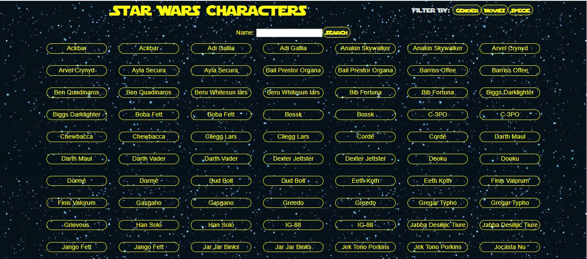
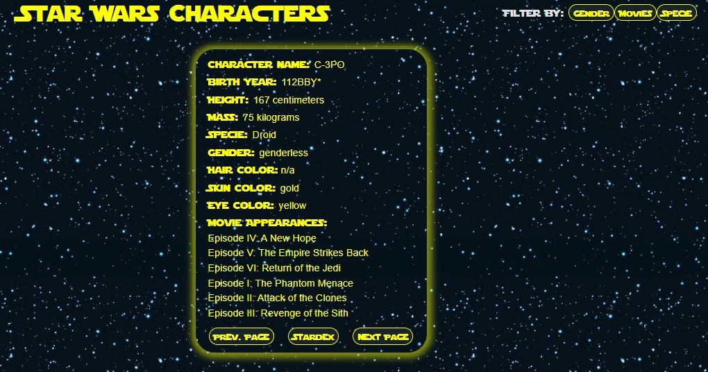
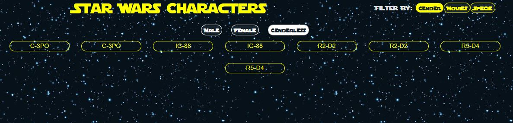
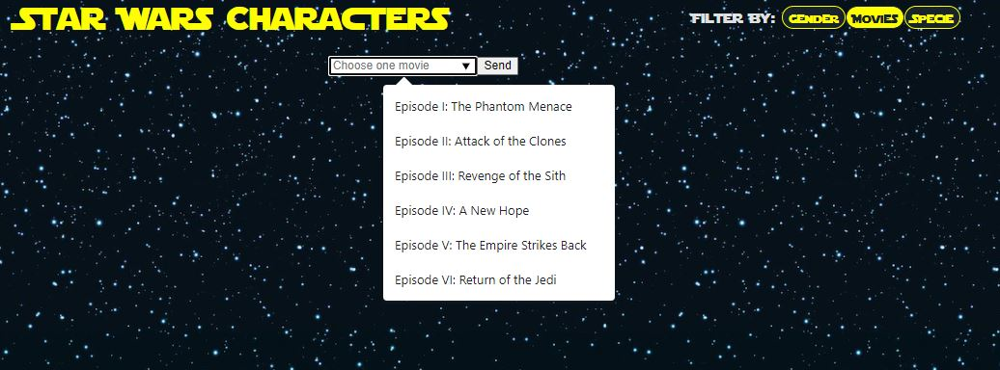

# `Banco de Talentos Plataforma Impact`

## Projeto desenvolvido para o processo seletivo do Banco de Talentos Jedi da Plataforma Impact .

[Sobre](#sobre-) - [Softwares & Ferramentas](#softwares--ferramentas-utilizadas-neste-projeto-) - [Deploy](#deploy-) - [Licença](#licenca-) - [Contato](#contato-)

## Sobre 🔎    


***Conceito*** 💡  
O objetivo desse desafio é construir catalogo com Cards de informações sobre personagens de Star Wars (Um card para cada personagem) buscando as informações usando a Api publica [SWAPI](https://swapi.dev/)


---

## Softwares & Ferramentas utilizadas neste projeto 📚

- HTML5
- CSS3
- JavaScript
- React
- Vite
- React-Router-Dom
- Node.js
- API Rest
- Axios
- Dot env
- Git
- GitHub

---


## Deploy 🚀

### ***Utilização da aplicação web*** 📝:

você irá acessar a landing page:
onde aparecerá essa tela de carregamento enquanto a requisição para a API é feita.


em seguida será encaminhado para a pagina /characters.

### ***Página /character***
 Essa pagina contém: 
 - o stardex, que é o catalogo de cards dos personagens contendo seus nomes (*e ao clicar no card com o nome do personagem você também será encaminhado para a página interna que contém as informações detalhadas do personagem*)  
 - a barra de pesquisa por nome de personagem, que te leva diretamente para a págna interna de cada personagem.
 - os botões de header que te levam para as rotas /gender, /movies e /specie onde poderá filtrar os cards conforme os parametros: gênero, filme em que aparece e raça respectivamente.   
 

   

### ***Página /card***
essa pagina contém o card com as informações detalhadas do personagem , bem como botões de navegação entre os cards (prev. page e next page) e também um botão de navegação de volta ao stardex



### ***Página /gender***

nesta página existem 3 botões para que possa selecionar qual filtro aplicar: Male - para personagens masculinos, Female - para personagens femininos e Genderless - para personagens que não tem gênero, como é o caso dos Droids



### ***Página /specie***

nesta página existe um input do tipo lista com os valores de cada espécie para que possa ser selecionada e então ao clicar no botão send o filtro é aplicado.


### ***Página /movie***

nesta página existe um input do tipo lista com os valores de um dos filmes para que possa ser selecionada e então ao clicar no botão send para aplicar o filtro.



---

### ***Utilização para Desenvolvimento*** ⚙️

Primeiramente será necessário clonar esse repositório, você acessar pelo terminal a pasta aonde quer clonar o repositório e rodar o seguinte comando:

```
git clone https://github.com/Joao-P-G-Begiato/Banco-de-talentos.git
```
ou então acessar através do [repositorio do GitHub](https://github.com/Joao-P-G-Begiato/Orange-notes) clicar em code e depois Download ZIP:   

  

---

### ***Instalação das dependencias*** :

*Front-end REACT* 💠 :   

Para trabalhar com o front-end em react, depois de clonar o repositório precisará instalar as dependências do vite e do react, para isso rode os seguintes comandos no terminal:

acesse a pasta da interface da aplicação WEB:
```
cd \frontend/banco-de-talentos-jedi
```
e depois peça para instalar as depências necessárias:
```
npm i
```
esse comando irá baixar todas as dependencias necessárias para rodar a aplicação.

depois para visualizar a aplicação nessa mesma pasta rode o comando:

```
npm run dev
```

---

### ***Instalação do Node*** 🔧:

caso não tenha o Node instalado precisará seguir o seguinte passo-a-passo:

*Windows: 🔰*


Você pode baixar direto pelo site: [node](https://nodejs.org/en/)

Ou então via Chocolatey:
```
choco install nodejs-lts
```

*Mac: 🍎*

Você pode baixar direto pelo site: [node](https://nodejs.org/en/)

*Linux:🐧* 

via apt e snap:

```
sudo apt-get install curl

curl -fsSL https://deb.nodesource.com/setup_lts.x | sudo -E bash -

sudo apt-get install -y nodejs
```

---

## Contato 

Projeto desenvolvido por mim, João Paulo Gotardi Begiato e para me contatar pode-se utilizar os seguintes meios:

 [Linked-In](https://www.linkedin.com/in/joaopgbegiato/)  
 [GitHub](https://github.com/Joao-P-G-Begiato)  
 jpbegiato@hotmail.com  


---

## Licença 📄

Este projeto está sob a licença MIT - veja o arquivo [LICENSE](https://github.com/Joao-P-G-Begiato/Banco-de-talentos/blob/Jo%C3%A3o-Paulo-Gotardi-Begiato-Frontend/frontend/banco-de-talentos-jedi/LICENSE) para detalhes.

---

[⬆ Voltar ao topo](#Banco-de-Talentos-Plataforma-Impact-)