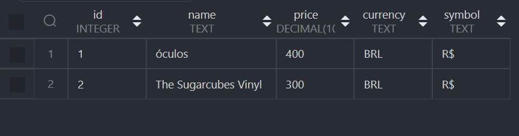
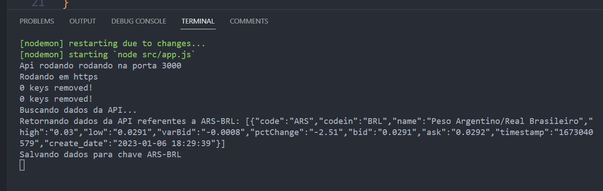
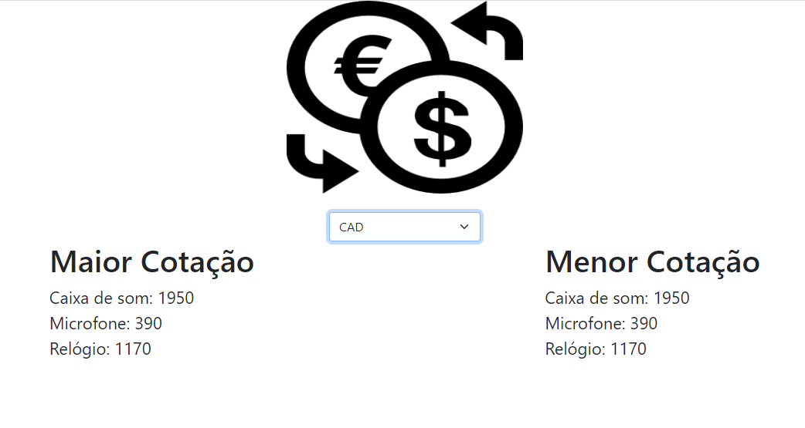
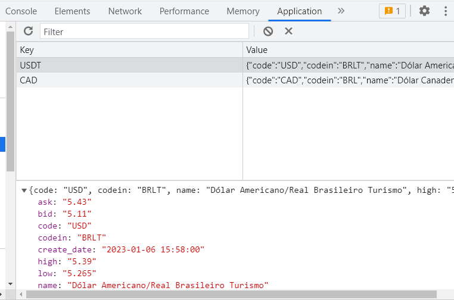

#  PROGRAMA JEDI - DESAFIO BACKEND

> ## Desafio

Crie uma API REST, que responda os seguintes métodos:

[get] /Products (todos os produtos) <br>
[get/post/put/delete] /Products/$ID (por ID) <br> 
[get] /Currency/ (todas as cotações) <br>
[get] /Currency/$symbol (exemplo: BRL, USD, EUR) <br>

Os produtos devem ser cadastrados em BRL, usando a API Rest
A cotação das outras moedas deve vir da API:
https://economia.awesomeapi.com.br/all/USD-BRL para USD
https://economia.awesomeapi.com.br/all/EUR-BRL para EUR
Ou, se preferir você pode buscar todas as moedas e encontrar as cotações usando o identificador, através do endpoint:
https://economia.awesomeapi.com.br/all
Armazene os dados da cotação em cache para evitar atingir o limite de requests da api;

> ## Descrição da aplicação

A aplicação é uma API no padrão REST que gerencia e automatiza um banco de dados de produtos. Foi integrado cache nas requisições da api de cotação, além de uma página simples utilizando CSS, Bootstrap e JavaScript para exibir os preços dos produtos cadastrados a partir das maiores e menores cotações disponibilizadas pela API de economia.

<br>
<br>

> ## Tecnologias utilizadas

Para o desenvolvimento da API foi utilizado JavaScript com NodeJS, Express, o banco de dados relacional SQLite e o REDIS para cache.


<br>

## Inicialização da aplicação via terminal

```
git clone https://github.com/luanyoliveira16/Banco-de-talentos.git
```

Em seguida, entre na pasta backend utilizando o seguinte comando no terminal:

```
cd Banco-de-talentos
cd backend
```

Depois

```
git checkout luany-oliveira-backend
```

E, por fim, instale todas as dependências necessárias:

```
npm i
```

<br>

É necessário que o REDIS esteja sendo executado. De forma simples você pode instalar o REDIS na sua máquina através dos seguintes links:
<br>

- <strong> <a href='https://github.com/microsoftarchive/redis/releases'> WINDOWS </a> </strong> Após extrair os arquivos do ZIP, basta abrir o <em>redis-serve.exe</em>.
<br>

- <strong> <a href='https://redis.io/docs/getting-started/installation/install-redis-on-linux/'> LINUX </a> </strong>


<br>
<br>

Em seguida:

```
npm run dev
```

## Dependências necessárias

```js
"dependencies": {
    "axios": "^1.2.2",
    "cors": "^2.8.5",
    "express": "^4.18.2",
    "fs": "^0.0.1-security",
    "https": "^1.0.0",
    "jest": "^29.3.1",
    "node-fetch": "^3.3.0",
    "node-schedule": "^2.1.0",
    "nodemon": "^2.0.20",
    "redis": "^4.5.1",
    "sqlite": "^4.1.2",
    "sqlite3": "^5.1.4",
    "swagger-jsdoc": "^6.2.7",
    "swagger-ui-express": "^4.6.0"
  },
  },
```
Todas dependências necessárias estão <a href = 'https://github.com/luanyoliveira16/Banco-de-talentos/blob/luany-oliveira-backend/backend/package.json'>neste arquivo</a>. 

## Produtos



### Ver todos os produtos:

Utilizar o método HTTP GET no caminho <b>"url da api" + /products</b>
<br>

### Buscar produto:

Utilizar o método HTTP GET no caminho <b>"url da api" + /product/:id</b>
<br>

### Adicionar produto:

Utilizar o método HTTP POST no caminho <b>"url da api" + /product</b>. No corpo da requisição é necessário inserir dados para todos os atributos dessa entidade.
Especificações dos campos:

- <strong> symbol </strong>: colocar R$.
- <strong> currency </strong>: deve constar o BRL.

<br>

### Alterar um produto já existente:
Utilizar o método HTTP PUT no caminho <b>"url da api" + /product/:id</b> passando novamente todos os campos presentes na entidade, da mesma forma que o método anterior para adicionar um aluno, mas inserindo as modificações desejadas no corpo da requisição.
<br>

### Deletar um produto:
Utilizar o método HTTP DELETE no caminho <b>"url da api" + /product/:id</b>.

<br>
<br>

## Consulta API Economia

- <strong> COTAÇÃO DE MOEDAS ESPECÍFICAS </strong>: 

Utilizar o método HTTP GET no caminho <b>"url da api" + /currency/:currency</b>.
<br>
Exemplos: https://economia.awesomeapi.com.br/last/USD-BRL || https://economia.awesomeapi.com.br/last/USD-BRL,EUR-BRL,BTC-BRL  ...

- <strong> COTAÇÃO DE TODAS AS MOEDAS </strong>

Utilizar o método HTTP GET no caminho <b>"url da api" + /currency/all</b>.

- <strong> IMPORTANTE </strong>: A resposta da requisição aparecerá no console, assim como as atividades do cache.
<br>



### Página com preços

Basta abrir o arquivo index.html dentro da pasta view. A cada requisição o próprio navegador armazena as repostas no seu LocalStorage.




## Inicialização da aplicação via terminal

```
git clone https://github.com/luanyoliveira16/Banco-de-talentos.git
```

Em seguida, entre na pasta backend utilizando o seguinte comando no terminal:

```
cd Banco-de-talentos
cd backend
```

Depois

```
git checkout luany-oliveira-backend
```

E, por fim, instale todas as dependências necessárias:

```
npm i
```

<br>


É necessário que o REDIS esteja sendo executado. De forma simples você pode instalar o REDIS na sua máquina através dos seguintes links:
<br>

- <strong> <a href='https://github.com/microsoftarchive/redis/releases'> WINDOWS </a> </strong> Após extrair os arquivos do ZIP, basta abrir o <em>redis-serve.exe</em>.
<br>

- <strong> <a href='https://redis.io/docs/getting-started/installation/install-redis-on-linux/'> LINUX </a> </strong>


<br>
<br>

Em seguida:

```
npm run dev
```

> ## Testes Unitários

Para rodar os testes das validações da aplicação, basta abrir o terminal dentro da pasta do projeto e executar o código abaixo:

```
npm i jest
```
<br>
E 
<br>

```
npm run test
```

## Swagger

api/api-doc

## Obrigada!


