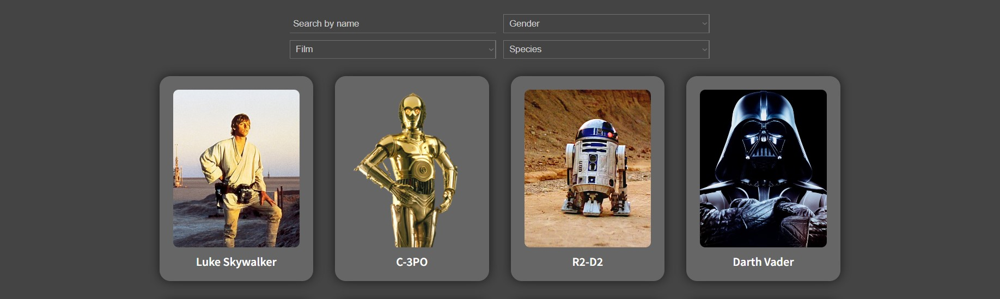

# Desafio Star Wars - Plataforma Impact

[Clique aqui para acessar o projeto](https://test-impact.vercel.app)

## Tecnologias utilizadas

* 

    

      Vite
    

    

      Facilita a criação de projetos enxutos, com rapidez na criação e templates para as libs mais comuns do mercado - neste projeto, utilizei o template React com Typescript.
    

  

* 

    

      Typescript
    

    

      Facilita o desenvolvimento ao tipar as funções, props dos componentes, estados, contextos etc.
    

  

* 

    

      React
    

    

      Biblioteca de Front End moderna com que tenho maior familiaridade - Permite a utilização de HTML em conjunto com JavaScript (JSX) e também a criação de componentes reutilizáveis.
    

  

* 

    

      React Router
    

    

      Permite a navegação facilitada entre rotas sem a necessidade de recarregar a página - Single Page Application (SPA).
    

  

* 

    

      Styled Components
    

    

      Facilita a criação dos estilos para os componentes, permitindo a utilização de JavaScript para gerar CSS, além da utilização de props para personalizar os estilos dos componentes.
    

  

## Como rodar o projeto

### Requisitos:
* Git
* Node.js
* npm / yarn

### Passo a passo:
* Clone o repositório na sua máquina:
  * `git clone <url-do-repo>`
* Acesse o repositório na pasta frontend:
  * `cd frontend`
* Instale as dependências:
  * `npm install`
* Execute o script de dev:
  * `npm run dev`
* Para acessar o projeto pela rede local, utilize a flag --host:
  * `npm run dev --host`
* Abra o navegador e acesse o ip do host com a porta indicada (5173 por padrão):
  * [http://localhost:5173/](http://localhost:5173/)
